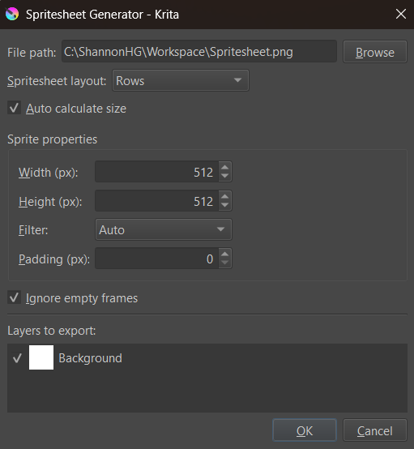

# Krita Spritesheet Generator
A Krita plugin capable of exporting animations as spritesheets.



## Installation
Use the following steps to install the **Spritesheet Generator** plugin and make it available in Krita:

1. Download this repository as a ZIP file by using the **Code -> Download ZIP** option on GitHub
2. Open Krita and navigate to **Settings -> Manage Resources**
3. Click the **Open Resources Folder** button to access your Krita resources folder
4. Unzip the previously download ZIP file
5. Copy and paste the `spritesheetgenerator/` folder and the `spritesheetgenerator.desktop` file into the `pykrita/` directory in your Krita resources folder
6. Close and reopen Krita
7. Navigate to **Settings -> Configure Krita -> Python Plugin Manager**
8. Find **Spritesheet Generator** in the list of plugins and enable it by checking its checkbox
9. You should now be able to access **Spritesheet Generator** from the **Tools -> Scripts** menu. If you're still unable to see it, then you may need to restart Krita.

## Usage
After installation, the **Spritesheet Generator** can be opened by navigating to **Tools -> Scripts -> Spritesheet Generator**. See below for details on the various options that can be configured.

* **File path:** The file path that the spritesheet will be exported to. The **Browse** button can be used to open the computer's native file manager.

* **Spritesheet layout:** Determines how the sprites will be organized in the spritesheet.
    * **Rows:** Consecutive sprites will be placed in the same row. Once the row is full, the process will be repeated for the following rows.
    * **Columns:** Consecutive sprites will be placed in the same column. Once the column is full, the process will be repeated for the following columns.
    * **Horizontal Strip:** Sprites will be organized into a single horizontal line.
    * **Vertical Strip:** Sprites will be organized into a single vertical line.

* **Auto calculate size:** If enabled (default), will automatically determine the number of rows and columns needed in the spritesheet. Otherwise, rows and columns can be manually defined.
* **Rows:** The number of rows in the spritesheet. This option is only available when **Auto calculate size** is disabled.
* **Columns:** The number of columns in the spritesheet. This option is only available when **Auto calculate size** is disabled.

* **Sprite dimensions:** Options related to the individual size of each sprite in the spritesheet.
    * **Width:** The desired width of each individual sprite. If this is different than the width of the current document, then the sprites will be resized before being placed in the spritesheet.
    * **Height:** The desired height of each individual sprite. If this is different than the height of the current document, then the sprites will be resized before being placed in the spritesheet.
    * **Filter:** The algorithm that will be used to resize the sprites (if needed).
    * **Padding:** The size of the transparent border added to sprites in the spritesheet. Useful to avoid sprites bleeding into each other.

* **Ignore empty frames:** If enabled (default), empty frames in the animation timeline will not be included in the spritesheet.
* **Layers to export:** Controls which layers will be considered for inclusion in the spritesheet.

---

## Animation Markers & JSON Export (Fork Addition)

This fork adds two features on top of the original plugin:

1. **JSON metadata export** — a `.json` sidecar file is written alongside the spritesheet PNG, containing frame indices, durations, and animation names. This is designed for use with the companion [Godot importer addon](`<your Godot addon repo URL here>`).

2. **Animation markers** — named animations can be defined directly in the Krita layer panel using a group naming convention, without needing to manage any external files.

### Defining animations with marker groups

By default the entire timeline exports as a single animation named `default`. To export multiple named animations, create a **Group Layer** for each animation and name it using the pattern:

```
A_animationname:startframe-endframe
```

To make an animation play once instead of looping, append `:once`:

```
A_animationname:startframe-endframe:once
```

Examples:

| Group name | Animation name | Frames | Loops |
|---|---|---|---|
| `A_idle:0-18` | `idle` | 0–18 | yes |
| `A_walk:19-34` | `walk` | 19–34 | yes |
| `A_walk_cycle:19-34` | `walk_cycle` | 19–34 | yes |
| `A_death:35-50:once` | `death` | 35–50 | no |

Place your art layers **inside** the marker group. Groups that don't match the `A_name:start-end` pattern are ignored for animation metadata and composite into the spritesheet normally.

A typical layer panel:

```
[Group]  A_idle:0-18
    └─  face
    └─  legs
    └─  body
[Group]  A_walk:19-34
    └─  face
    └─  legs
    └─  body
[Layer]  Background
```

### Ignore empty frames with markers

When **Ignore empty frames** is enabled, the exporter scans the child layers inside each marker group for keyframes. Only frames where a keyframe exists are exported, and the hold duration of each frame is derived from the gap between keyframes. This is the recommended setting when your animations use holds (e.g. a 4-drawing walk cycle spread across 24 frames at 24fps).

When disabled, every frame in the marker range is exported at uniform duration.

### JSON output format

The exported `.json` file is written to the same folder as the PNG with the same base name. It contains one entry per animation:

```json
{
    "spritesheet": "my_character.png",
    "fps": 24,
    "frameWidth": 128,
    "frameHeight": 128,
    "columns": 4,
    "rows": 2,
    "animations": [
        {
            "name": "idle",
            "loop": true,
            "frameCount": 4,
            "frames": [
                { "index": 0, "timelineFrame": 0, "durationFrames": 6, "durationSeconds": 0.25 },
                { "index": 1, "timelineFrame": 6, "durationFrames": 6, "durationSeconds": 0.25 }
            ]
        }
    ]
}
```
